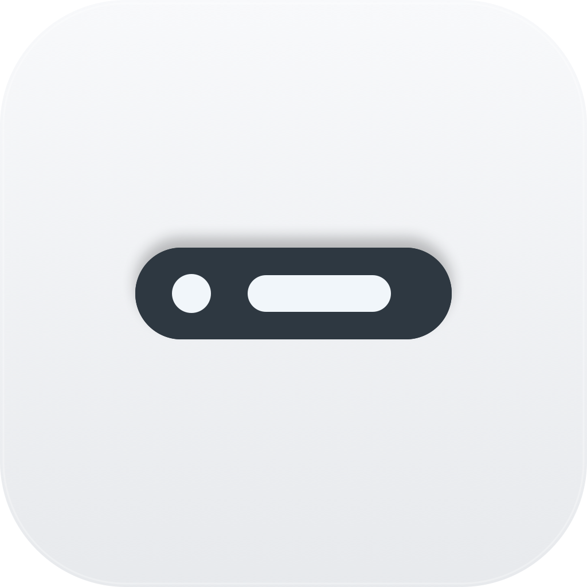

<p align="center">
  <picture>
    <source media="(prefers-color-scheme: dark)" srcset="Design/AppIcon/Previews/listenbar-icon-dark.png">
    
  </picture>
</p>

<h1 align="center">ListenBar</h1>

<p align="center">A native macOS menu bar utility for seeing what is listening on your Mac.</p>

<p align="center">
  
  
  
  
  
  
  <a href="https://github.com/ygsgdbd/ListenBar/releases/latest"></a>
</p>

<p align="center">🇨🇳 <a href="README.zh-CN.md">简体中文</a> · 🇺🇸 <strong>English</strong></p>

## 🖼️ Screenshots


## ✨ Highlights

- 🔎 **Find listeners at a glance.** Scan TCP `LISTEN` endpoints and UDP sockets with a concrete local port, then see their exposure, protocol, port, PID, process or app name, executable path, command line, inferred source, and resident memory when available.
- 🧩 **Understand which process owns each port.** Related helper processes are grouped under their owning macOS app, while command-line listeners remain separated by PID. Current-user processes are also distinguished from system or other-user processes.
- 🔗 **Open services and copy what you need.** Open eligible loopback TCP services at `http://localhost:<port>`, or copy URLs, ports, PIDs, paths, `lsof` commands, process details, and complete listener reports.
- 🔒 **Share diagnostics more safely.** Choose between full and redacted command-line copy actions to omit sensitive arguments when needed.
- 🛠️ **Inspect and manage processes.** Reveal executables in Finder, view native app or executable icons, quit or force-quit apps, and send `SIGTERM` or `SIGKILL` to individual processes, with confirmation for destructive or higher-risk actions.
- 🔄 **Keep the list current.** Refresh whenever the menu opens, use an optional 1-, 2-, or 5-second interval, disable automatic refresh, or check for updates manually through Sparkle.
- 🚀 **Launch at login.** Start ListenBar automatically after signing in, with a direct link to macOS Login Items settings when approval is required.

## 🪶 Native and lightweight

- 🍎 **Truly native.** ListenBar's app business code is 100% Swift, built with SwiftUI and The Composable Architecture (TCA). It uses `MenuBarExtra` and `LSUIElement` instead of an Electron runtime or embedded WebView.
- 🪶 **Ultra-lightweight software.** ListenBar stays focused on inspecting local listeners without shipping an entire browser engine.
- 🎨 **At home on macOS.** The interface automatically follows Light and Dark Mode. Native SwiftUI menu controls adopt the system-provided Liquid Glass appearance where appropriate on macOS 26, while macOS 14 and macOS 15 retain their own native styling. ListenBar does not simulate Liquid Glass with custom visual effects. Releases are built with Xcode 26.2.

## 📦 Installation

### Requirements

- macOS 14 Sonoma or later
- Apple Silicon or Intel Mac (Universal Binary)

### Homebrew

The `brew trust` command first shipped with Homebrew 5.1.15 on June 3, 2026. In Homebrew 5.1.15 through 5.x, trust was required only when `HOMEBREW_REQUIRE_TAP_TRUST=1` was set. Starting with Homebrew 6.0.0 on June 11, 2026, casks from non-official taps require explicit trust by default.

```bash
brew tap ygsgdbd/tap
brew trust --cask ygsgdbd/tap/listenbar
brew install --cask listenbar
```

This trusts only the `listenbar` cask, not the entire tap. Homebrew stores the trust entry, so you normally need to run the trust command only once. See Homebrew's [Tap Trust documentation](https://docs.brew.sh/Tap-Trust) for details.

Homebrew 5.1.14 and earlier do not have `brew trust` and do not require it:

```bash
brew tap ygsgdbd/tap
brew install --cask listenbar
```

If `brew trust` reports `Unknown command: trust`, skip that command or run `brew update` to upgrade Homebrew.

Update Homebrew installations with:

```bash
brew upgrade listenbar
```

#### Tap Trust Troubleshooting

- If Homebrew reports `Refusing to load cask ... from untrusted tap`, run `brew trust --cask ygsgdbd/tap/listenbar`, then retry the installation or upgrade.
- If `brew doctor` reports that `ygsgdbd/tap` is untrusted, trust only the ListenBar cask with the command above; trusting the entire tap is not required.
- If an existing installation stops upgrading after Homebrew is updated to 6.0.0 or later, trust the cask and retry `brew upgrade listenbar`.
- To trust every current and future formula, cask, and external command in the tap, use `brew trust ygsgdbd/tap`. This grants broader access and is not the recommended option.

### GitHub Releases

1. Download `ListenBar-macOS-universal.zip` from the [latest GitHub Release](https://github.com/ygsgdbd/ListenBar/releases/latest).
2. Unzip it and move `ListenBar.app` to `/Applications`.

### First launch and Gatekeeper

Current release builds are **unsigned and not notarized**. macOS may therefore block the first launch even when the app was downloaded from the official release page.

1. In Finder, Control-click or right-click `ListenBar.app`, choose **Open**, then choose **Open** again.
2. If macOS still blocks it, open **System Settings → Privacy & Security**, find the ListenBar warning, click **Open Anyway**, and confirm **Open**.

Only bypass Gatekeeper when you obtained the app from this repository's official GitHub Releases and trust the download.

## 🧪 Development and tests

The project currently contains **140 XCTest test methods** covering reducer behavior, settings persistence, login item management, port parsing and grouping, process metadata, menu presentation, screenshot fixtures, and Sparkle configuration.

Requirements: Xcode 26, [Homebrew](https://brew.sh/), [just](https://github.com/casey/just), [SwiftFormat](https://github.com/nicklockwood/SwiftFormat), and [Tuist](https://tuist.dev/).

Install the development tools manually, then enable the repository-managed Git hook:

```bash
brew install just swiftformat tuist
swiftformat --version # Must be 0.62.1
just setup
just check
```

`just setup` only checks the installed tools and configures `core.hooksPath`; it never installs or upgrades software. If Homebrew no longer provides SwiftFormat 0.62.1, install that exact version from the [official release](https://github.com/nicklockwood/SwiftFormat/releases/tag/0.62.1).

Before each commit, the hook formats staged Swift files. When formatting changes are required, the commit stops so you can review the diff, stage the updated files, and retry. Partially staged Swift files are not modified automatically; stage or stash the remaining edits, or run `just format` manually. Run `just --list` to see all available development commands.

To run the test command directly:

```bash
tuist generate --no-open
xcodebuild test \
  -project ListenBar.xcodeproj \
  -scheme ListenBar \
  -destination 'platform=macOS' \
  -testLanguage zh-Hans \
  -skipPackagePluginValidation \
  -skipMacroValidation \
  CODE_SIGN_IDENTITY='' \
  CODE_SIGNING_ALLOWED=NO \
  CODE_SIGNING_REQUIRED=NO
```
