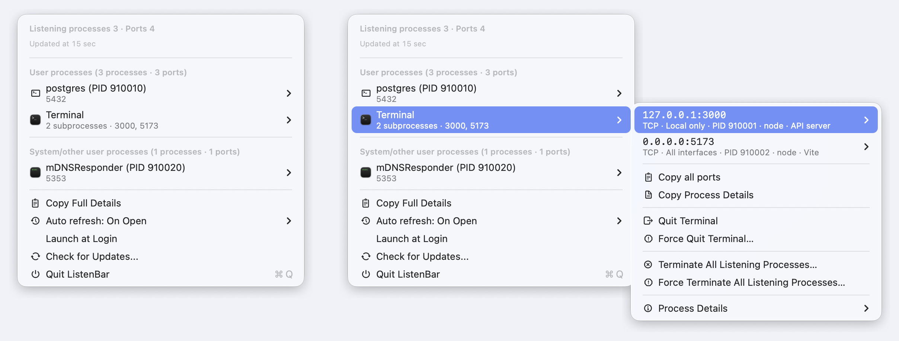
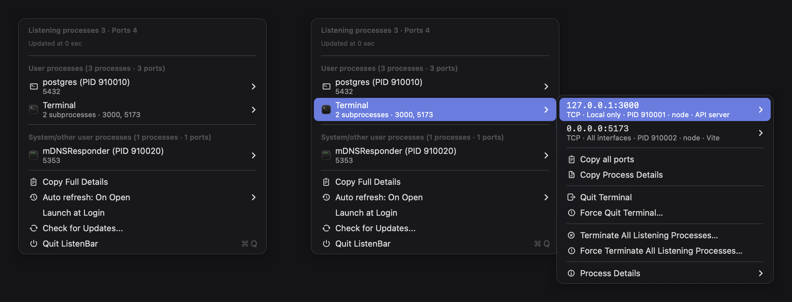

<p align="center">
  
</p>

<h1 align="center">ListenBar</h1>

<p align="center">A native macOS menu bar utility for seeing what is listening on your Mac.</p>

<p align="center">
  
  
  
  
  
  
  <a href="https://github.com/ygsgdbd/ListenBar/releases/latest"></a>
</p>

<p align="center"><a href="README.zh-CN.md">简体中文</a></p>

## ✨ Highlights

- Scans TCP `LISTEN` endpoints and UDP sockets that expose a concrete local port.
- Shows address exposure, protocol, port, PID, process or app name, executable path, command line, inferred source, and resident memory when available.
- Groups related helper processes under their owning macOS app; command-line listeners remain clearly separated by PID.
- Separates current-user processes from system or other-user processes for safer inspection.
- Opens eligible loopback TCP services at `http://localhost:<port>` and copies URLs, ports, PIDs, paths, `lsof` commands, process details, or the complete listener report.
- Provides both full and redacted command-line copy actions so sensitive arguments can be omitted when sharing diagnostics.
- Reveals executables in Finder and displays native application or executable icons where available.
- Supports normal app quit, force quit, per-process `SIGTERM`, and `SIGKILL`, with confirmations for destructive or higher-risk targets.
- Refreshes when the menu opens by default, with optional 1-, 2-, or 5-second intervals or refresh disabled.
- Checks for updates manually through Sparkle from the menu.

## 🪶 Native and lightweight

ListenBar's app business code is 100% Swift, built with SwiftUI and The Composable Architecture (TCA). It is a real native menu bar app based on `MenuBarExtra` and `LSUIElement`—there is no Electron runtime and no embedded WebView. That keeps the app focused and avoids shipping a browser engine for a small system utility.

The interface follows the system appearance automatically in both Light and Dark Mode. Releases are built with Xcode 26.2. On macOS 26, using native SwiftUI menu controls allows the system to apply its Liquid Glass appearance where appropriate; macOS 14 and macOS 15 retain their native system styling. ListenBar does not simulate Liquid Glass with custom visual effects.

## 🖼️ Screenshots

### Light



### Dark



## 📦 Installation

### Requirements

- macOS 14 Sonoma or later
- Apple Silicon or Intel Mac (Universal Binary)

### Homebrew

```bash
brew tap ygsgdbd/tap
brew install --cask listenbar
```

### GitHub Releases

1. Download `ListenBar-macOS-universal.zip` from the [latest GitHub Release](https://github.com/ygsgdbd/ListenBar/releases/latest).
2. Unzip it and move `ListenBar.app` to `/Applications`.

### First launch and Gatekeeper

Current release builds are **unsigned and not notarized**. macOS may therefore block the first launch even when the app was downloaded from the official release page.

1. In Finder, Control-click or right-click `ListenBar.app`, choose **Open**, then choose **Open** again.
2. If macOS still blocks it, open **System Settings → Privacy & Security**, find the ListenBar warning, click **Open Anyway**, and confirm **Open**.

Only bypass Gatekeeper when you obtained the app from this repository's official GitHub Releases and trust the download.

## 🧪 Development and tests

The project currently contains **109 XCTest test methods** covering reducer behavior, port parsing and grouping, process metadata, menu presentation, screenshot fixtures, and Sparkle configuration.

Requirements: Xcode 26 and [Tuist](https://tuist.dev/).

```bash
tuist generate
xcodebuild test \
  -project ListenBar.xcodeproj \
  -scheme ListenBar \
  -destination 'platform=macOS' \
  -testLanguage zh-Hans \
  -skipPackagePluginValidation \
  -skipMacroValidation \
  CODE_SIGN_IDENTITY='' \
  CODE_SIGNING_ALLOWED=NO \
  CODE_SIGNING_REQUIRED=NO
```
