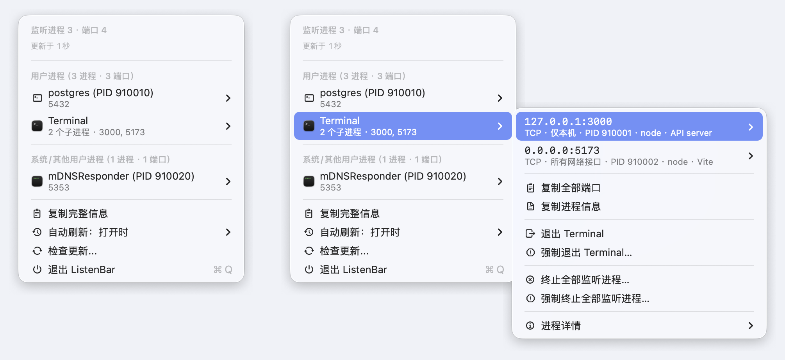
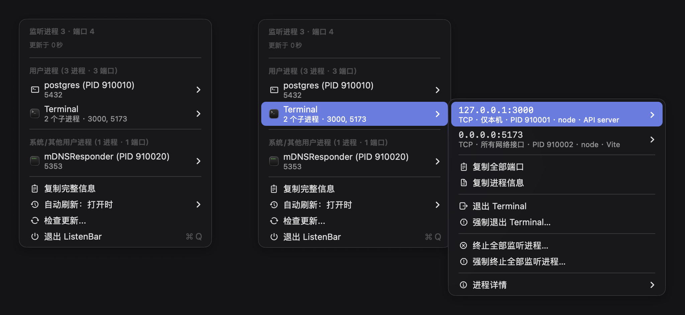

# ListenBar

[English](README.md)

ListenBar 是一款用于查看本机监听端口的 macOS 菜单栏工具。

## 界面截图

### 浅色模式



### 暗色模式



## 功能

- 纯菜单栏 App（`LSUIElement`）
- 使用 SwiftUI `MenuBarExtra`
- 使用 TCA reducer 和可测试的端口扫描依赖
- 列出 TCP `LISTEN` 端口和具有明确端口的 UDP socket
- 在可识别 macOS App 时按 App 分组，否则按进程 PID 分组
- 支持退出或强制退出可识别的 macOS App，同时保留对单个监听进程的控制
- 支持通过 `SIGTERM` 终止和通过 `SIGKILL` 强制终止进程，并对高风险目标显示确认提示
- 支持从菜单中手动检查 Sparkle 更新

## 开发

```bash
rtk tuist generate
rtk xcodebuild test \
  -project ListenBar.xcodeproj \
  -scheme ListenBar \
  -destination 'platform=macOS' \
  -testLanguage zh-Hans \
  -skipPackagePluginValidation \
  -skipMacroValidation \
  CODE_SIGN_IDENTITY='' \
  CODE_SIGNING_ALLOWED=NO \
  CODE_SIGNING_REQUIRED=NO
```

如需重新生成内容固定且不包含隐私信息的 README 截图，请先为终端或 Codex 授予“屏幕与系统音频录制”和“辅助功能”权限，退出其他正在运行的 ListenBar 实例，然后执行：

```bash
./script/generate_readme_screenshots.sh
```

## 安装

```bash
brew tap ygsgdbd/tap
brew install --cask listenbar
```

也可以从 GitHub Releases 下载 `ListenBar-macOS-universal.zip`。

## 发布

推送 `vX.Y.Z` tag 后会创建新版本。GitHub Actions workflow 会构建通用 macOS App、发布 `ListenBar-macOS-universal.zip`、生成 `checksums.txt`、为 Sparkle 签名并上传 `appcast.xml`，同时更新 `ygsgdbd/homebrew-tap`。

首次发布前，请在 `ygsgdbd/ListenBar` 仓库中设置以下 secrets：

```bash
gh secret set SPARKLE_ED_PRIVATE_KEY --repo ygsgdbd/ListenBar < /path/to/listenbar-sparkle-ed-private-key
gh secret set HOMEBREW_TAP_TOKEN --repo ygsgdbd/ListenBar --body "$HOMEBREW_TAP_TOKEN"
```

Sparkle 公钥已嵌入 `Project.swift`；对应私钥不得提交到仓库。
